# Kalkulator-HPP-Sederhana  
<div align="justify">
Aplikasi Kalkulator Harga Pokok Penjualan (HPP) berbasis Java Command Line (CLI). Aplikasi ini tidak menggunakan database, melainkan menyimpan seluruh data secara statis ke dalam file JSON lokal. Proyek ini dirancang sebagai latihan manajemen proyek, pembagian modul antar anggota, serta implementasi alur bisnis sederhana dalam Java.  
</div>

## Cover
<h2 align="center">Laporan: Kalkulator HPP</h2>

<h3 align="center">
Disusun untuk memenuhi tugas mata kuliah Algoritma dan Struktur Data<br>
Dosen Pengampu: Ichsan Taufik ST., MT.
</h3>

<p align="center">
  
</p>

<h3 align="center">Disusun Oleh:<br>Kelompok 2</h3>

<div align="center">

<pre>
Firda Azzahra                        1247050059
Ghevyra Nur Fadilah                  1247050011
Ibnu Rafiq Hariri                    1247050068
Keira Arina Khalisha                 1247050056
Muhammad Al Ghifari Gunawan          1247050118
Muhammad Khansa Khalifaturohman      1247050115
Muhammad Zadit Taqwa Indana Zulva    1247050034
</pre>

</div>

<h2 align="center">
Fakultas Sains dan Teknologi<br>
Program Studi Teknik Informatika<br>
Universitas Islam Negeri Sunan Gunung Djati Bandung<br>
2025
</h2>


## Kata Pengantar
<div align="justify">
Puji syukur kami panjatkan kepada Allah SWT. karena dengan rahmat dan karunia-Nya kami bisa menyelesaikan laporan tugas akhir statistika yang berjudul “Kalkulator HPP” ini dengan baik dan tepat pada waktunya. Tidak lupa kami  menyampaikan rasa terima kasih kepada nama nama berikut:  

1. Bapak Ichsan Taufik ST., MT. selaku dosen mata kuliah Algoritma dan Struktur Data yang telah membimbing dan  mengajar kami.   
2. Orang Tua kami yang telah mendoakan serta memberi dukungan kepada kami dalam pengerjaan laporan ini.   
3. Rekan-rekan kelompok 2 yang telah memberikan kontribusi berupa bantuan dalam pengerjaan dan lain-lain sehingga laporan makalah ini bisa selesai pada waktu yang telah ditentukan.

Meskipun kami telah mengerjakan laporan ini dengan teliti, namun kami menyadari bahwa di dalam laporan yang telah kami susun ini jauh dari kata sempurna sehingga kami harap saran serta masukan dari pembaca demi tersusunnya laporan praktikum selanjutnya yang lebih baik. Kami harap hasil laporan kami bermanfaat bagi pembaca.   
</div>

## Daftar Isi
- [Cover](#cover)
- [Kata Pengantar](#kata-pengantar)
- [Jalankan Program](#jalankan-program)
- [Deskripsi](#deskripsi)
- [Flowchart](#flowchart)
- [Screenshot per Menu](#screenshot-per-menu)
- [Tugas Masing-Masing Anggota](#tugas-masing-masing-anggota)

## Jalankan Program  
**1. Download File**  
Klik tombol "Code" lalu download format ZIP 
<div align="center">
  
</div>

Atau bisa dengan perintah Command Prompt:  
```cmd
cd <folder yang mau kamu jadikan tempat simpan folder project ini>
git clone https://github.com/MKhansa067/Kalkulator-HPP-Sederhana.git
```

Bisa disimpan di folder mana saja.  

**2. Buka Project**  
Buka Apache Netbeans IDE 21, jika belum install, bisa melalui link: https://archive.apache.org/dist/netbeans/netbeans-installers/21/Apache-NetBeans-21-bin-windows-x64.exe  
Setelah dibuka, klik "File" lalu klik "Open Project" dan pilih folder yang sudah di download.  

<p align="center">
  
</p>

Lalu pilih folder program.  
<p align="center">

</p>

**3. Run File**  
Setelah project terbuka, klik kanan pada mouse, lalu klik "Run File" seperti pada gambar ini.  
<p align="center">
  
</p>

Dan program sudah berjalan.  


## Deskripsi
### Fitur Utama   
**1. Sistem Login & Register**  
- Setiap pengguna dapat membuat akun.
- Data akun disimpan di data/user.json.
- Mendukung login, logout, serta penyimpanan progress per user.  

**2. Dashboard**  
Menampilkan rangkuman data:  
- Total produk
- Total pendapatan
- Rata-rata harga jual
- Produk terlaris (berdasarkan data penjualan statis)

**3. Manajemen Bahan Baku**  
- Tambah bahan baku: nama bahan, satuan (g, kg, ml, l, pcs, pack), harga per satuan, stok
- Tampilkan semua bahan
- Edit bahan baku
- Cari bahan baku

**4. Manajemen Produk**  
- Tambah produk: nama produk, yield per batch, waktu kerja per batch, pemilihan bahan baku beserta jumlahnya (resep)
- Edit produk
- Cari produk
- Setiap produk memiliki komponen: Ingredients, RecipeItem, dan harga otomatis dihitung lewat service.

**5. Kalkulator HPP**  
Menghitung HPP per unit dan harga jual berdasarkan margin yang ditentukan:
- Biaya bahan per unit
- Biaya pekerja per unit
- Total HPP per unit
- Harga jual dengan margin (10% – 100%)
- Estimasi pendapatan per bulan

**6. Penyimpan Data JSON**  
Seluruh data berikut disimpan dalam file JSON per user:
- Bahan baku
- Produk
- Rekam penjualan
- Data dashboard  
Digunakan Gson untuk serialisasi/deserialisasi.  

### Alur Program  
1. User membuka aplikasi → tampilan beranda
2. Login / Register
3. Masuk ke Dashboard
4. Pilih modul:
   - Bahan Baku
   - Produk
   - Kalkulator HPP
5. Data diperbarui dan disimpan ke file JSON secara otomatis
6. User logout atau keluar aplikasi  

### Teknologi yang Digunakan
- Java 17+
- Maven (build tool NetBeans)
- Gson (untuk JSON)
- CLI / Command Line Interface


## Flowchart

**1. Halaman Beranda**
- Login  
- Register  
- Exit  

<p align="center">
  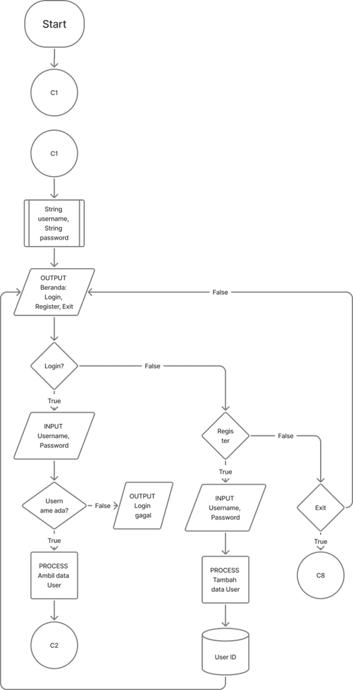
</p>

**2. Halaman Dashboard**
- Lihat ringkasan dashboard  
- Kelola Bahan Baku  
- Kelola Produk  
- Kalkulator HPP  
- Penjualan (tambah record)  
- Logout  
- Simpan & Exit  

<p align="center">
  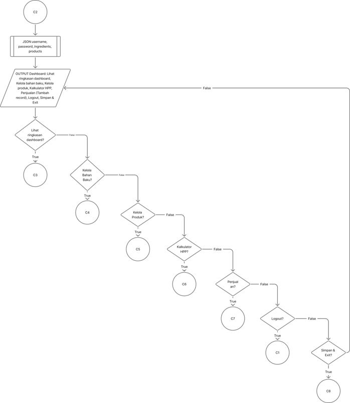
</p>

**3. Kelola Bahan Baku**
- Tambah bahan baku  
- Edit bahan baku  
- Tampilkan semua  
- Cari bahan baku  
- Kembali  

<p align="center">
  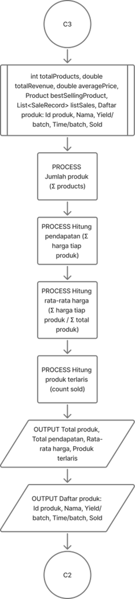
</p>

**4. Kelola Produk**
- Tambah produk  
- Edit produk  
- Tampilkan semua  
- Cari produk  
- Kembali  

<p align="center">
  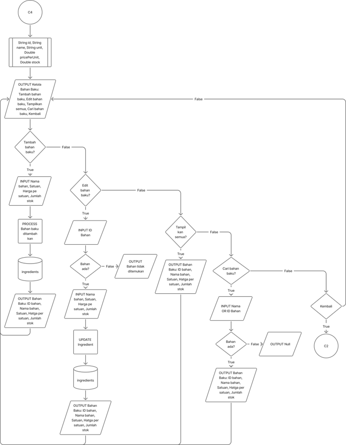
</p>

**5. Kalkulator HPP**

<p align="center">
  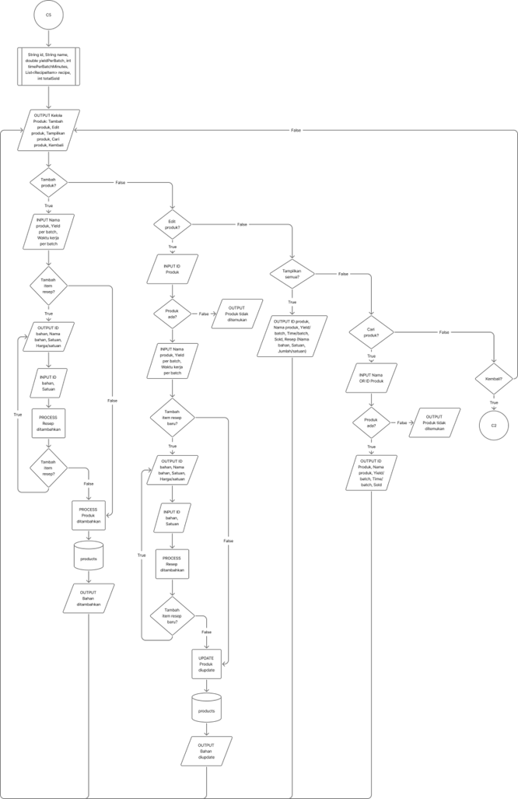
</p>

**6. Penjualan (Tambah Record)**

<p align="center">
  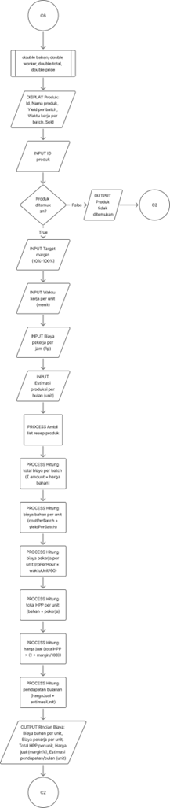
</p>

**7. Logout**

<p align="center">
  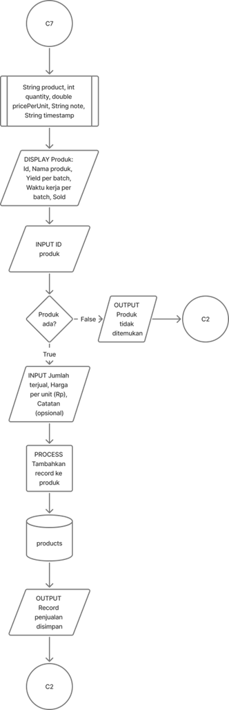
</p>

**8. Simpan & Exit**

<p align="center">
  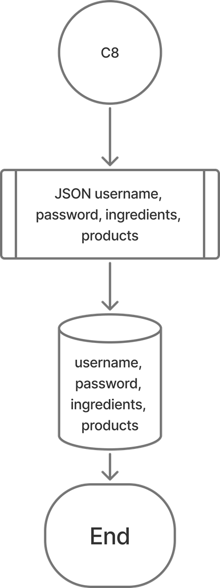
</p>


---

## Screenshot per Menu

**1. Halaman Beranda**

<p align="center">
  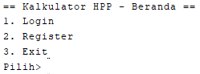
</p>

**2. Halaman Dashboard**

<p align="center">
  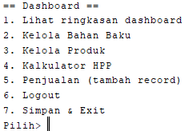
</p>

**3. Kelola Bahan Baku**

<p align="center">
  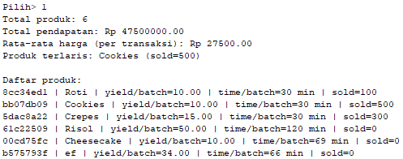
</p>

**4. Kelola Produk**

<p align="center">
  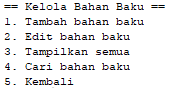
</p>

**5. Kalkulator HPP**

<p align="center">
  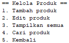
</p>

**6. Penjualan (Tambah Record)**

<p align="center">
  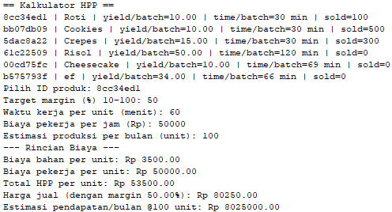
</p>


## Tugas masing-masing Anggota

**1. Khansa**  
<p align="justify">
Bertanggung jawab atas program <i>KalkulatorHPP.java</i>, yang berfungsi sebagai menu utama dan pengatur alur aplikasi secara keseluruhan. Program ini memastikan pengguna dapat login, bernavigasi ke semua sub-menu (bahan, produk, HPP, dashboard), serta memanggil seluruh service lain dalam urutan yang benar.
</p>

**2. Keira**  
<p align="justify">
Mengembangkan <i>AuthService</i> dan model <i>UserData</i>, yang bertugas mengelola autentikasi (login/register) sekaligus menjadi container utama untuk seluruh data pengguna (bahan, produk, penjualan). Data masing-masing pengguna tersimpan terpisah dan digunakan sesuai sesi pengguna.
</p>

**3. Zadit**  
<p align="justify">
Membuat <i>InventoryService</i> dan model <i>Ingredient</i>, yang mengelola seluruh data bahan baku. Fungsinya meliputi penambahan, pengeditan, pencarian, dan penampilan stok bahan baku. Modul ini menjadi sumber data utama mengenai harga dan ketersediaan material.
</p>

**4. Ibnu**  
<p align="justify">
Mengembangkan <i>ProductService</i> dan model <i>Product</i>, yang fokus pada manajemen produk dan resep. Modul ini memungkinkan pembuatan serta pengeditan produk, sekaligus menghubungkan produk dengan bahan-bahan (yang dikelola oleh Zadit) untuk membentuk struktur resep.
</p>

**5. Alghifari**  
<p align="justify">
Menyusun <i>HPPCalculatorService</i> dan model <i>RecipeItem</i>, yang menjadi mesin perhitungan utama. Service ini menggunakan data resep dari Ibnu dan harga bahan dari Zadit untuk menghitung Harga Pokok Penjualan (HPP) per batch dan per unit, serta membantu menentukan harga jual produk.
</p>

**6. Ghevyra**  
<p align="justify">
Membuat <i>DashboardService</i> dan model <i>SaleRecord</i>, yang berfungsi mengumpulkan dan menampilkan ringkasan performa bisnis. Modul ini menghitung total pendapatan, harga rata-rata, serta produk terlaris berdasarkan catatan penjualan yang dimasukkan oleh pengguna.
</p>

**7. Firda**  
<p align="justify">
Bertanggung jawab atas <i>StorageService</i> dan <i>ConsoleUtil</i>. <i>StorageService</i> menangani penyimpanan data melalui file <code>user.json</code> (read/write), sedangkan <i>ConsoleUtil</i> memastikan semua input dari pengguna tervalidasi dan aman sebelum diproses oleh service lain.
</p>

### Sekian, Terima Kasih.
